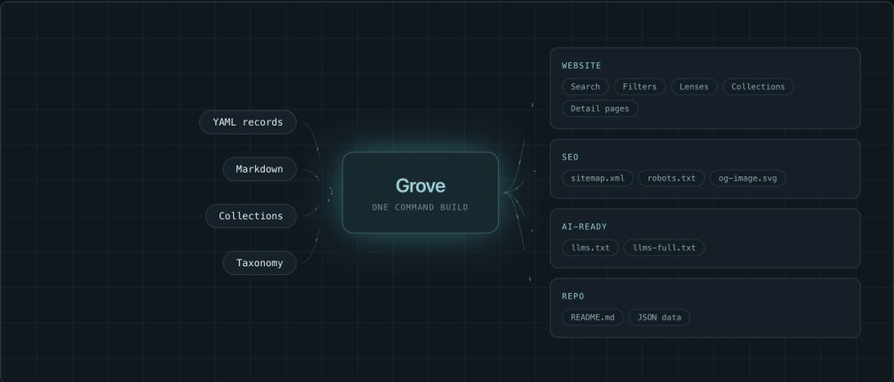
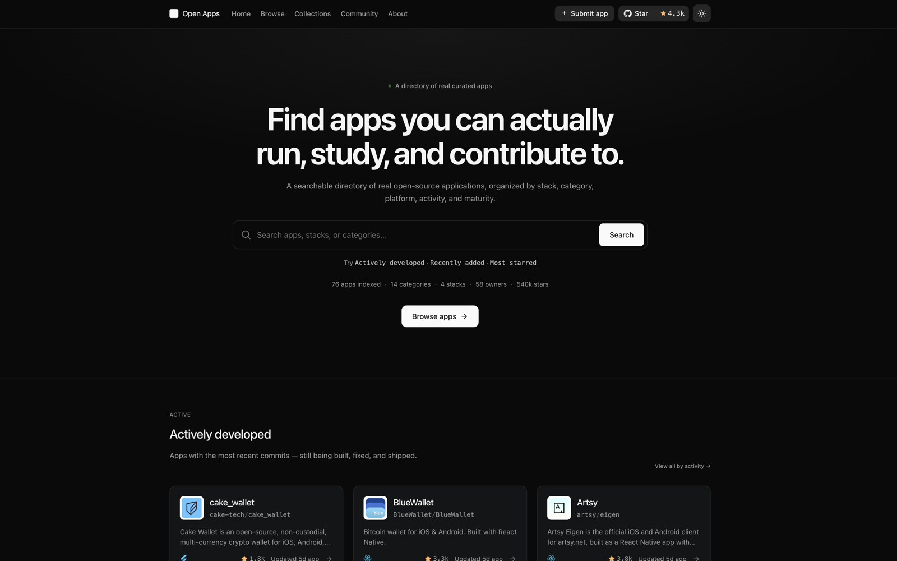
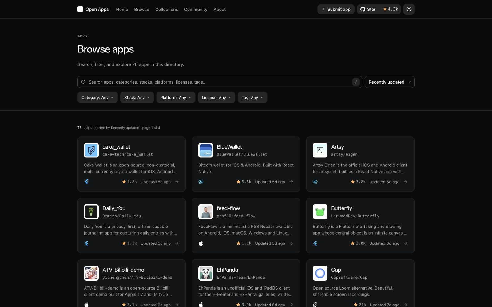
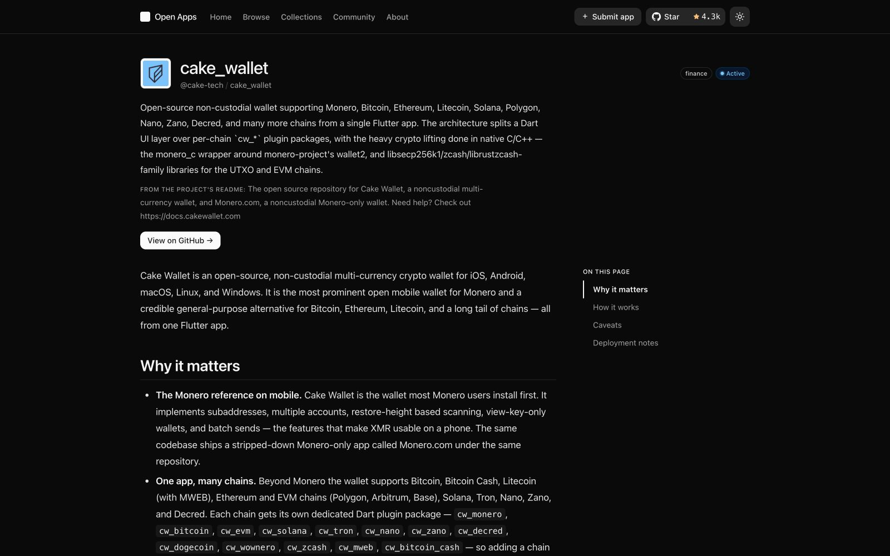
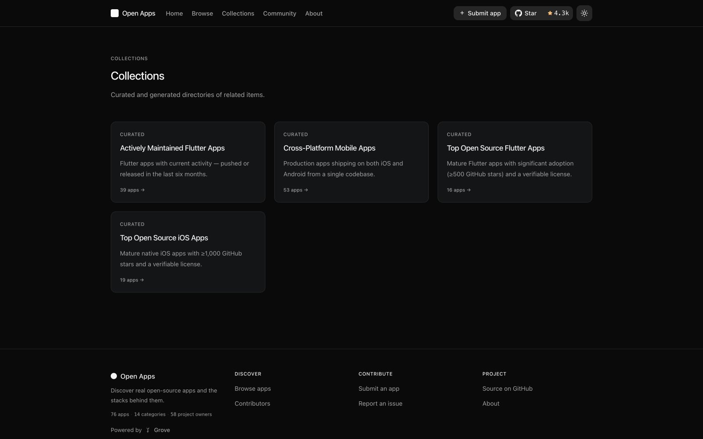

<div align="center">

# 🌱 Grove

**Maintain structured knowledge in files. Publish it everywhere. Keep it in sync.**

Grove turns YAML, Markdown, and other user-owned sources into fast websites,
curated collections, repository content, SEO metadata, and machine-readable
outputs. No database, no CMS, and no runtime server required.

[](https://www.npmjs.com/package/@grove-dev/cli)
[](https://github.com/tortuvshin/grove/actions/workflows/ci.yml)
[](LICENSE)
[](https://deepwiki.com/tortuvshin/grove)

[Website](https://withgrove.dev/) ·
[Documentation](https://withgrove.dev/introduction/) ·
[Quick start](https://withgrove.dev/getting-started/create-a-space/) ·
[Live example](https://openappscout.com/) ·
[npm](https://www.npmjs.com/package/@grove-dev/cli)

</div>

## One source, every surface

<a href="https://withgrove.dev/">
  
</a>

Files remain the source of truth. Generated files are disposable build
artifacts, and scheduled workflows refresh external facts without taking
editorial judgment away from maintainers.

## What Grove ships today

- **A complete static site.** One command scaffolds an Astro project with
  search, filters, lenses, curated collections, record pages, submission
  guidance, and contributor pages.
- **Structured, portable content.** Records, taxonomy, collections, decisions,
  and overrides live in reviewable YAML; long-form content lives in Markdown.
- **Multiple outputs from the same files.** A build produces the website,
  normalized JSON datasets, `sitemap.xml`, `robots.txt`, Open Graph images,
  `llms.txt`, `llms-full.txt`, and optionally a generated README section.
- **Maintenance on rails.** Grove validates sources, refreshes GitHub and
  contributor metadata, identifies stale or archived records, and leaves the
  final keep/hide/remove decision in a file.
- **Consumer-owned presentation.** The generated project owns its Astro pages
  and product copy. Grove supplies schemas, domain logic, data adapters, and
  reusable UI without silently replacing local customization.
- **Static-first deployment.** The result is plain HTML, JSON, and text files
  that can ship to Cloudflare, Vercel, Netlify, GitHub Pages, or any static
  host.

## Quick start

Requirements: Node.js `>=22.12.0` and pnpm `10.34.5`.

```bash
pnpm dlx @grove-dev/cli@latest init my-space
cd my-space
pnpm dev
```

The scaffold is a real, complete Grove site — not a separate demo template.
Start by editing these three surfaces:

```text
data/records/       one YAML file per record
grove.config.ts     identity, routes, facets, theme, integrations, audit pages
src/pages/          site-owned routes and page composition
```

Grove prepares generated artifacts automatically before `astro dev`,
`astro check`, and `astro build`.

```bash
pnpm exec grove check               # validate sources and rebuild outputs
pnpm exec grove update              # take upstream UI changes, keeping local edits
pnpm exec grove sync github         # refresh repository metadata
pnpm exec grove sync contributors   # refresh community metadata
pnpm exec grove cleanup             # write the human-review queue
pnpm exec grove readme generate     # update a generated README section
pnpm build                           # produce the deployable static site
```

See the [CLI reference](https://withgrove.dev/reference/cli/) for collection
promotion, import, icon synchronization, and Lighthouse audit commands.

## A real operating model

[Open Apps](https://openappscout.com/) is the production reference that
shaped Grove: file-backed records, searchable views, curated collections,
repository refreshes, health signals, detail pages, contributor data, a
sitemap, and AI-readable outputs. Grove turns that proven operating model into
reusable packages and a project scaffold for other kinds of structured
knowledge.

<table align="center">
  <tr>
    <td align="center" valign="top" width="420">
      <a href="https://openappscout.com/">
        
      </a>
      <br />
      <a href="https://openappscout.com/"><strong>Home</strong></a>
      <br />
      <sub>Search, live ecosystem stats, and actively developed applications.</sub>
    </td>
    <td align="center" valign="top" width="420">
      <a href="https://openappscout.com/apps/">
        
      </a>
      <br />
      <a href="https://openappscout.com/apps/"><strong>Browse</strong></a>
      <br />
      <sub>Search, filtering, sorting, and health-aware application cards.</sub>
    </td>
    <td align="center" valign="top" width="420">
      <a href="https://openappscout.com/apps/cake_wallet/">
        
      </a>
      <br />
      <a href="https://openappscout.com/apps/cake_wallet/"><strong>Detail</strong></a>
      <br />
      <sub>Project context, source-derived facts, and structured editorial content.</sub>
    </td>
    <td align="center" valign="top" width="420">
      <a href="https://openappscout.com/collections/">
        
      </a>
      <br />
      <a href="https://openappscout.com/collections/"><strong>Collections</strong></a>
      <br />
      <sub>Curated and generated views built from the same source records.</sub>
    </td>
  </tr>
</table>

The example matters because Grove is not defined by directories. A directory
is one useful presentation; the product is the publishing and maintenance
system underneath it.

## Repository

```text
packages/
  core/       framework-free schemas, validation, generation, and maintenance
  astro/      Astro integration, data adapters, and server view models
  cli/        project creation and maintenance commands
  registry/   the UI source `grove init` installs and `grove update` reconciles
  starlight/  Grove's documentation theme and integration
apps/
  example/    reference consumer; mirrors the generated scaffold byte-for-byte
  docs/       product site and documentation at withgrove.dev
```

| Package                                      | Role                                                                                                          |
| -------------------------------------------- | ------------------------------------------------------------------------------------------------------------- |
| [`@grove-dev/core`](packages/core)           | Config, schemas, validation, generated data, collections, health, sitemap, AI outputs, and maintenance logic. |
| [`@grove-dev/astro`](packages/astro)         | Astro integration, generated-data adapters, and server view models. Ships no components — UI lives in the registry. |
| [`@grove-dev/cli`](packages/cli)             | Scaffolding, checks, synchronization, cleanup, imports, audits, icons, collections, and README generation.    |
| [`@grove-dev/starlight`](packages/starlight) | The Starlight theme and documentation integration used by Grove.                                              |

`@grove-dev/registry` is a fifth workspace package. It is private and never
published to npm; its built items are served from the docs site and baked
into the CLI tarball.

There is no hidden hosted backend. The UI a space renders is installed into
that space's own `src/` and owned there — `grove init` writes it, and
`grove update` reconciles it against upstream without ever overwriting a
file the space has modified. `apps/example` mirrors the generated scaffold
byte-for-byte, enforced in CI, so the project users create stays aligned
with the site this repository builds and tests.

## Develop Grove

```bash
pnpm install
pnpm dev
pnpm check
pnpm test
pnpm build
pnpm test:scaffold
```

For the documentation site, run `pnpm dev:docs`.

## Principles

- Files are the source of truth; outputs are derived.
- One piece of content should serve many human and machine surfaces.
- Automation should reduce drift while keeping decisions transparent.
- Static publishing and portable formats are the default.
- Infrastructure must earn its place; Grove does not require a database or
  application server.

## License

[MIT](LICENSE) © Grove contributors.
